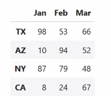
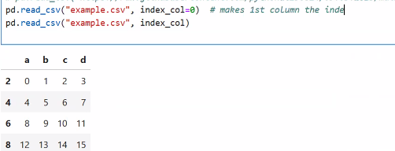
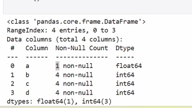
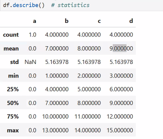
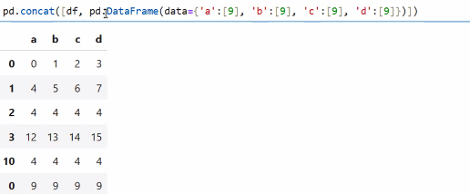

# dataScience-Lec5-9-MAR-25
Pandas
* add operator in Series:pd_1.add(pd_2, fill_value) -100+200
  * if there is a match by keys,add the values
  * else add NAN or fill_value to the value.
  * if not the same dtype, through exception
* dataFrame= 2d, size mutable data structure with labelled (rows and columns)
  * a 2d table, with index by rows and index by columns
  * **can be considered as a list of Series with the same keys.**
  * create dataFrame:
    * example1:
    ```
    data=np.random.randint(1-101,(4,3))
    df=pd.DataFrame(data)
    print type(df)= DataFrame
    print df= prints as 2d array with inedexes ((0-len-1),(0-len-1))
    ```
    * example2:
    ```
    full_index=pd.DataFrame(data,index=my_rows,columns=my_cols
    ```
    ** my_rows and my_cols will replace the indexes of the 2d structure
    * must be same sizes of the data
    * access row:
      * full_index.loc['CA'],loc['NY':'AZ']= return Series with index value 'CA'
      * full_index.iloc[1],iloc[1:3],[::-1]= return Series with location 1
      
    * access column: 
      ```
      full_index['Jan']= return as a Series
      full_index[['Jan']]= return as a dataframe
      full_index[['Jan','Feb']]= return as a dataframe
      full_index.iloc[:]= return all dataframe
      full_index[:,1:3]= return dataframe with columns 1-3
      ```
  * import data from file csv
    * in Excel: select cells->ctrl+d-> convert to table with filters.
    ```
    pd.read_csv(r'C:\Users\Shani\OneDrive\Documents\school\Ecom\dataScience\dataScience-Lec5-9-MAR-25\example.csv')
    pd.read_csv('example.csv')
    pd.read_csv("https://raw.githubusercontent.com/pythonai250824/09.03.2025/main/example.csv")
    ```
    ** define index cols:
   
  * get columns:
    * df.columns: return object from Index type
    * list(df.index=return range type): return a list of all indexes=df.keys()
    * df.head(number rows): print by default the first 5 rows
    * df.last(number rows): print last rows
    * df.info: meta details(organic data): columns names, details of each, dtype and their counters, memory usage
    
      * if no value return the worst type float
    * df.describe(): dataframe of statistics of the data (doesn't need to be sorted) by columns values  
    
      * std: סטיית תקן בעמודה
      * 25% (df.percentile(data,25): what's the number x that 25% from the numbers<=x, after sort asc
      * 50%: what's the number x that 50% from the numbers<=x, after sort asc
      * 75%: what's the number x that 75% from the numbers<=x, after sort asc
    * df.shape: returns the length of the dataframe(4,4)
    * delete rows,columns: df.drop(columns=['a'])=drop('a',axis=1),df.drop(index=0)=drop(0)=drop(0,axis=0)- or both with options.
    * insert : 
      * df.insert column: df.insert(1,1,data)
      * df.loc[2]=[4,4,4,4]=upsert to index(key) 2: data=[4,4,4,4]
      * df.loc[10]=[4,4,4,4]=upsert to index(key) 10: data
      * using concat: create new df and concat both:
      
      * reset last index add optional ignore_index=True- reset indexes as auto-increment
      * reset last index add optional ignore_index=False- concat first df with new df with their origin indexes